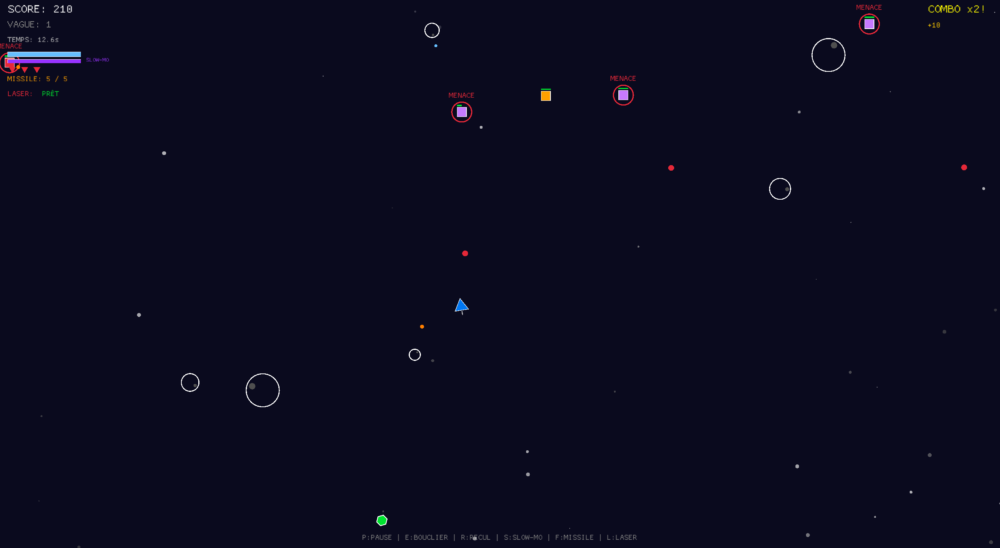

# Void Survivor

A fast-paced space shooter written in Rust with [Macroquad](https://macroquad.rs/).  
Defeat waves of asteroids and drones, collect power-ups, and survive as long as possible.

## Features

- Player ship with rotation, thrust, and reverse boost
- Shield with energy management
- Slow‑motion ability (limited resource)
- Rapid‑fire power‑up
- Homing missiles (limited ammo, auto‑regen)
- Piercing laser (cooldown‑based)
- Three drone types (Kamikaze, Sniper, Bomber)
- Asteroids that break apart
- Combo system, score, waves, screen shake
- Visual effects: explosions, muzzle flashes, trails, particles
- Power‑ups: Shield refill, Extra life, Slow‑mo refill, Rapid fire
- WebAssembly (WASM) support – play in the browser

## Controls

| Action              | Key         |
|---------------------|-------------|
| Turn left / right   | ← / →       |
| Thrust forward      | ↑           |
| Reverse / brake     | ↓           |
| Shoot               | Space       |
| Shield (hold)       | E           |
| Reverse boost       | R           |
| Slow motion (hold)  | S           |
| Fire homing missile | F           |
| Fire piercing laser | L           |
| Pause               | P           |
| Menu / Exit         | Escape      |
| Start / Restart     | Enter       |

*All keys can be changed in `src/consts.rs`.*

## How to Play

- Your goal: survive as many waves as possible and achieve the highest score.
- Defeat enemies to increase your combo multiplier and score.
- Green power‑ups grant extra lives, blue refills your shield, purple refills slow‑mo, orange gives temporary rapid fire.
- The shield consumes energy but absorbs all damage; it recharges slowly when not in use.
- Slow‑motion slows down time but drains energy; it recharges when not active.
- Missiles are limited but regenerate over time; lasers have a cooldown.

## Building and Running

### Prerequisites
- Rust (stable) and Cargo: [https://rustup.rs/](https://rustup.rs/)
- (Optional) `cargo-generate` or `trunk` for WASM – not strictly required.

### Native (Desktop)
```bash
cargo run --release


### WebAssembly (WASM)

Macroquad supports compilation to WASM. To build and serve the game in a browser:

1. **Add the WASM target**  
   `rustup target add wasm32-unknown-unknown`

2. **Build the WASM binary**  
   `cargo build --release --target wasm32-unknown-unknown`

3. **Copy the generated `.wasm` file to the project root or a `web` folder**  
   The game expects `kill.wasm` (as defined in `index.html`).  
   ```bash
   cp target/wasm32-unknown-unknown/release/void_survivor.wasm .
   ```

4. **Serve the files with a simple HTTP server**  
   Example using `basic-http-server` (install with `cargo install basic-http-server`):  
   ```bash
   basic-http-server .
   ```
   Then open `http://localhost:4000` in your browser.

Alternatively, you can use `trunk` (install with `cargo install trunk`) and a modified `index.html` – but the provided `index.html` works with the standard Macroquad loader.

## Project Structure

```
src/
├── collisions.rs   # All collision rules
├── consts.rs       # Central configuration constants
├── effects.rs      # Particles, trail, visual effects
├── enemies.rs      # Asteroids, drones, bullets, power‑ups
├── events.rs       # Decoupled event queue for effects
├── game.rs         # Main Game struct, world, cooldowns, screen shake
├── lib.rs          # Module declarations
├── main.rs         # Entry point, scene management
├── rendering.rs    # Drawing functions
├── scenes.rs       # Menu, game, pause, game over scenes
├── ship.rs         # Player ship logic
├── ui.rs           # Heads‑up display and menus
└── weapons.rs      # Shooting, missiles, laser
```

## License

This project is provided as a code example.  
Feel free to use and modify it for learning purposes.

---

*Void Survivor – A Rust/Macroquad arcade shooter.*

```
